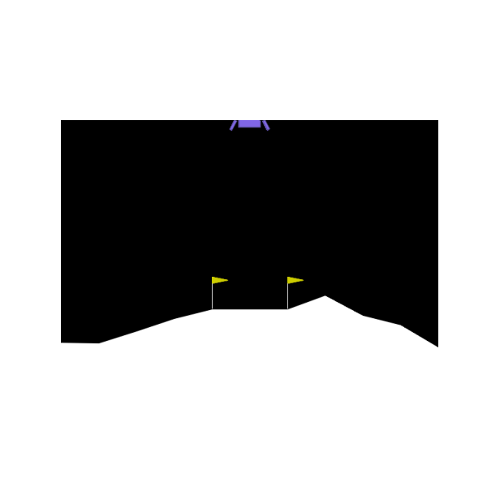

# lunar-lander
This project was made for FEEIT's course "Mobile Robotics" (3ФЕИТ01Л009). It showcases two implementations of the LunarLander environment using reinforcement learning: a classic 2D version and a fully custom 3D version.

The 2D version is based on OpenAI’s Gym LunarLander-v3, where a DQN agent learns to control a lander to touch down safely on a designated landing pad. The agent is trained for approximately 600 episodes using epsilon-greedy exploration and Q-learning updates. A GIF demo of the trained agent is included below.

The 3D version is built entirely from scratch using MuJoCo. It features a rocket with 3 legs, randomized starting conditions, a randomly generated terrain, and a fixed-position landing pad. The environment includes 6DoF physics, custom reward shaping, and realistic thrust and torque application. A Double DQN (DDQN) agent is trained for around 1000 episodes to land the rocket stably by minimizing tilt and achieving full-foot contact with the pad. A video demo of the 3D agent is included.

This project was built to explore how a 2D reinforcement learning problem scales into 3D, with added complexity in control, perception, and environment dynamics.
